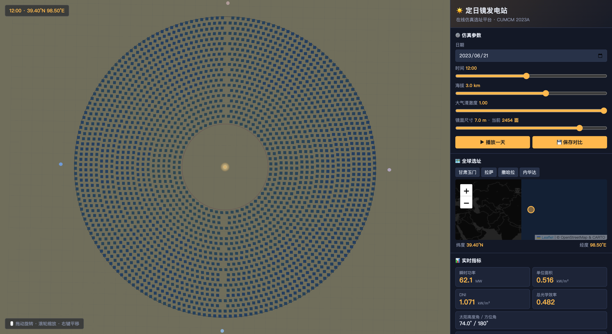
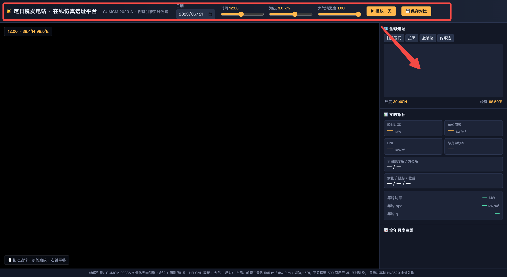

# 定日镜发电站 · 在线仿真选址平台

> **CUMCM 2023 A · 全流程复现 + 交互式 Web 仿真**
>
> 从物理建模到论文，再到面向企业/国家选址决策的浏览器仿真平台 —— 一个仓库全部搞定。



## ✨ 项目一览

- **📖 完整 CUMCM 2023A 论文（中文）** —— 建模思路、SOP 求解流程、Q1/Q2/Q3 完整结果（`paper/paper.md`）
- **⚙️ 矢量化光学引擎（Python）** —— 太阳几何、余弦、阴影/遮挡（射线-平面相交，矢量化）、HFLCAL 截断、大气透射（`code/engine.py`）
- **🌐 3D 交互式 Web 仿真平台** —— Three.js + Leaflet + Chart.js，实时物理仿真（`web/`）
- **📊 全套结果 & 图集** —— `results/*.json`, `results/result{2,3}.xlsx`, `figures/*.png`

## 🚀 一键启动 Web 平台

```bash
cd web/
./run.sh
```

自动挑选可用端口（8000/8080/8888/…），浏览器打开脚本提示的地址即可。

**依赖**：Python 3.8+、`fastapi`、`uvicorn`、`numpy`、`scipy`、`openpyxl`（`run.sh` 会自动检测并按需安装）。前端所有库通过 CDN 加载，**无需 npm 构建**。

## 🎮 平台核心功能

| 功能 | 说明 |
|---|---|
| 🗺️ **全球选址地图** | 点击 Leaflet 地图任意位置设定经纬度；预置甘肃玉门/拉萨/撒哈拉/内华达一键切换 |
| 🌐 **3D 镜场实时仿真** | Three.js 渲染 2000–7000 面定日镜，实时按太阳方向调整镜面朝向 |
| ☀️ **动态天空** | 24 小时时间轴 → 天空色从黎明橘 → 白天蓝 → 黄昏红 → 深夜蓝黑连续过渡 |
| 📊 **实时指标仪表盘** | DNI、余弦/阴影/截断/总光学效率、瞬时功率、单位面积功率 |
| 📈 **全年月度曲线** | Chart.js 双轴：12 个月的平均功率 + 平均光学效率 |
| 🔬 **多场地对比** | 保存任意个候选场地，柱状图并排比较年均功率 / ppa，辅助选址决策 |
| ⏯ **播放一天** | 自动从日出到日落播放，看整场镜面跟随太阳连续旋转 |
| 📐 **参数化布置** | 滑块调节镜面尺寸 2–8 m → 圈数、每圈镜数按物理规则自动生成，密度自然过渡 |

## 🏗️ 布置模型

- **同心密集环 + 东西向维护通道**
- 塔在场地正中心 (0, 0, 80 m)，集热器为圆柱面（Ø 7 m × 8 m）
- 每圈按物理最小间距 W+5 铺满，径向间距 dr = W+5 = 最小允许
- 沿 x 轴的 \|y\| < 4 m 走廊留空供维护车辆通行
- 镜面尺寸 2–8 m 可调（步长 0.5 m），镜面数自然由几何决定：
  - W=2 m → 约 7180 面（超密）
  - W=5 m → 约 3500 面（与论文 Q2 一致）
  - W=8 m → 约 2020 面（施工友好）

## 📁 目录结构

```
cumcm2023a/
├── README.md                  ← 本文件
├── paper/paper.md             ← CUMCM 完整论文（中文）
├── code/                      ← 物理引擎 + 三个问题的求解脚本
│   ├── engine.py                 矢量化光学引擎
│   ├── solve_p1.py               问题一：给定镜场评估
│   ├── solve_p2_final.py         问题二：等参数优化
│   ├── solve_p3.py               问题三：分区不等参数优化
│   └── make_figs_p{1,2,3}.py     出图
├── web/                       ← 交互式仿真平台
│   ├── app.py                    FastAPI 后端（3 个 API）
│   ├── engine_web.py             物理引擎的 Web 参数化包装
│   ├── run.sh                    一键启动
│   ├── README.md                 平台详细文档
│   └── static/
│       ├── index.html
│       ├── css/styles.css
│       └── js/                   scene.js / solar.js / map.js / charts.js / main.js
├── figures/                   ← 论文用图
├── results/                   ← 三个问题的完整数值结果
│   ├── problem1.json, problem2.json, problem3.json
│   └── result2.xlsx, result3.xlsx
├── archive/                   ← 原题 PDF & 附件（只读参考）
└── docs/                      ← 平台截图
```

## 🔬 物理模型

论文 §3 完整描述。核心是把光学效率分解为可乘的五项：

$$
\eta = \eta_{\cos} \cdot \eta_{sb} \cdot \eta_{at} \cdot \eta_{trunc} \cdot \eta_{ref}
$$

- **余弦效率 η_cos** = max(0, **n** · **s**)
- **阴影/遮挡 η_sb**：镜面表面 5×5 网格采样 + 射线-平面相交（矢量化，性能 25× 提升）
- **大气透射率 η_at**：随距离衰减的二次公式
- **截断效率 η_trunc**：HFLCAL 高斯圆锥近似（含镜面像 + 光束扩散）
- **反射率 η_ref** = 0.92（常数）
- 太阳锥光束 σ_sun = 2.51 mrad + 综合光学误差 σ_opt = 2.0 mrad（Pfahl 2017 / Ho 2008）

## 📊 论文关键结果

| 问题 | 设计 | η | 年均功率 | ppa |
|---|---|---|---|---|
| Q1 | 给定 1745 面 6×6, z=4 | 0.561 | 34.33 MW | 0.547 kW/m² |
| Q2 | 5×5, z=2.5, dr=10, 塔(0,−50), N=3520 | 0.553 | **47.42 MW** | **0.539 kW/m²** |
| Q3 | 分区（内 5×5，外 6×6）, 塔(0,0), N=3436 | 0.521 | **48.83 MW** | 0.508 kW/m² |

## 🖼️ 更多截图

<p align="center">
  
  
</p>

## 📄 许可 & 引用

- 论文正文与结果数据：作者原创（CUMCM 2023 A 题解答）
- 物理引擎：本人从零实现，纯 Python + NumPy
- Web 平台：本人 Three.js/Leaflet/Chart.js 前端 + FastAPI 后端

引用格式：

> CUMCM 2023A 求解 + 定日镜场在线仿真选址平台。
> https://github.com/clover200301-afk/resume-heliostat-platform

## 🙏 致谢

- 高教社杯全国大学生数学建模竞赛（CUMCM）2023 A 题
- Three.js、Leaflet、Chart.js、FastAPI 开源社区
